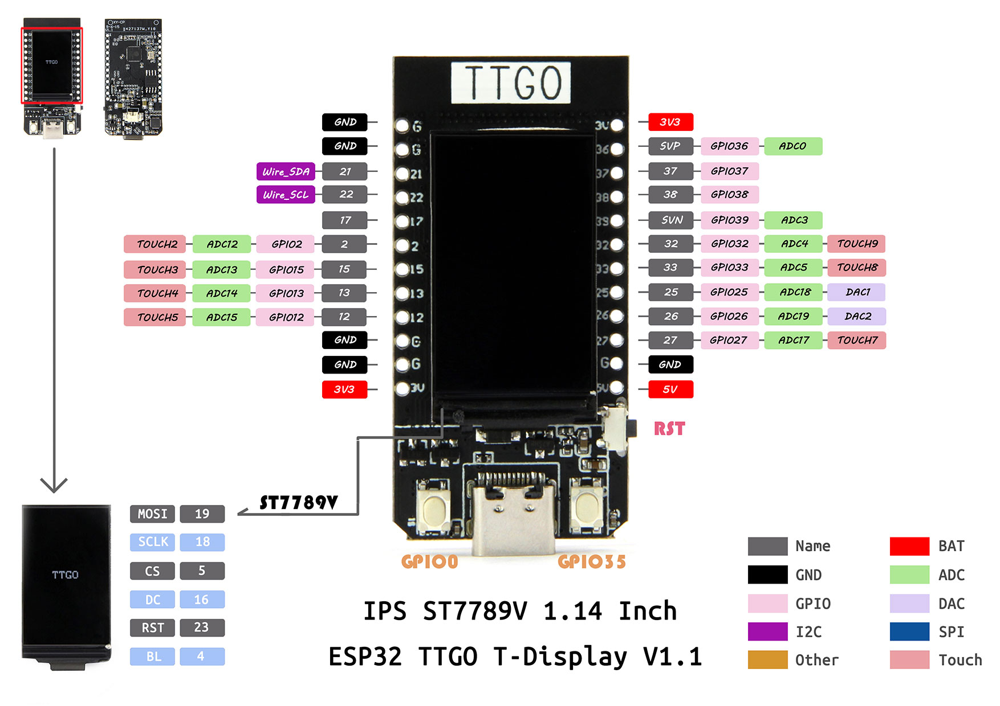

# ESP32 MQTT

This is a quick project to get started with the TTGO T-Display or clone devices as an MQTT client. It simplifies the implementation to displaying the MQTT message to the display and then calling a callback function where the user can implement whatever they want.

## Getting Started

First [setup your IDE per the IDE setup documentation](docs/IDE.md).

Next [follow the MQTT setup documentation](docs/MQTTSetup.md). You will rename some template files and edit the code to execute the functionality you desire.

This should be a quick and easy startup for this module. Contributions appreciated for better conformance to best practices but want the implementation to remain as generic as possible so it's easier for newbies starting up ESP32 development.

## Example Implementations

- [MQTT-Buzzer](examples/mqtt_buzzer/README.md) Use a 3.3v or 5v buzzer attached to the TTGO T-Display to create an IOT alarm buzzer for morning wakeup, general alerts, etc.
