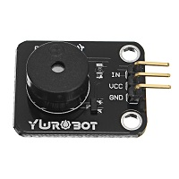

# MQTT Buzzer/Alarm

This is a simple implementation that incorporates a buzzer into the TTGO T-Display so that an alarm can be sound via MQTT.

## How It Works

The example will listen to the MQTT topic defined in MQTTInfo.h.

If the MQTT payload isn't 'snooze' or 'off' it will sound the buzzer, turn on the display and turn on the TFT backlight.

If either of the TTGO T-Display buttons is pressed and released, the buzzer is silenced, the display is shut off, and the module publishes 'snooze' to the MQTT topic. This is to signal other buzzers to shut off as well.

If it sees either 'snooze' or 'off' (configurable in MQTTInfo.h), it will silence the buzzer and shut off the display.

NOTE: The only difference in behavior "stop" and "snooze" is the devices send "snooze" but expect "stop" from an external source. There is no snooze timer built into the configuration because it is assumed you would be using something like Home Assistant, Node-Red, a python script, or another external tool to manage snoozing to coordinate other actions (like lights, blinds, etc) in your implementation. This also avoids having minor offsets in buzzers that could propagate over multiple snoozes if there isn't an external manager for snooze events.

An example implementation is to use a Node-Red flow, python script running on a raspberry pi, etc to trigger the alarm and when a snooze is received manage it there. For my specific case the initial trigger of the buzzers is done by Node-Red and is coupled with turning on some lights in home assistant, starting a music video from YouTube on my roku. When the flow receives a 'snooze' it dims the lights to 50% in home assistant and swaps the YouTube video for a no-sound screensaver before setting a 3-minute delay to re-trigger the lights to full and to change the YouTube video back to the music video of choice for my morning routine. My snoozes aren't canceled until I scan a QR code I have tapped to my coffee maker that hits an HTTP GET endpoint in the Node-Red flow.

## Parts

You'll need a PWM buzzer of some kind; either 3.3v or 5v (See comments in .h file for pin settings). For my implementation I used a YUROBOT buzzer module which is a 5v buzzer. I used GPIO 27 to keep the wires on one side and if you are using a 3.3v buzzer you'll likely want to switch to GPIO 12.

Solder the VCC wire to the 5v or 3.3v source on the TTGO T-Display, ground wire to the most convenient ground, and the IN or I/O (may vary based on what you buy) to the GPIO pin of choice.

## Deploy Example

- Copy `MQTTCallback_buzzer.cpp` to the `ttgo_t-display_mqtt` folder and rename it to `MQTTCallback.cpp.`
- Copy `MQTTInfo_buzzer.h` to the `ttgo_t-display_mqtt` folder and rename it to `MQTTInfo.h`.
- Edit the `MQTTInfo.h` to setup wifi, your MQTT broker info, stop/snooze trigger strings, and to modify any pins associated with your buzzer installation.
- Compile/Upload to your TTGO T-Display or similar module.
- Use python, Home Assistant, Node-Red or other mechanism of choice to send a message that isn't your snooze or stop command string. You should see the string appear on the screen and hear the buzzer sound.
- Send either "snooze" or "stop".
